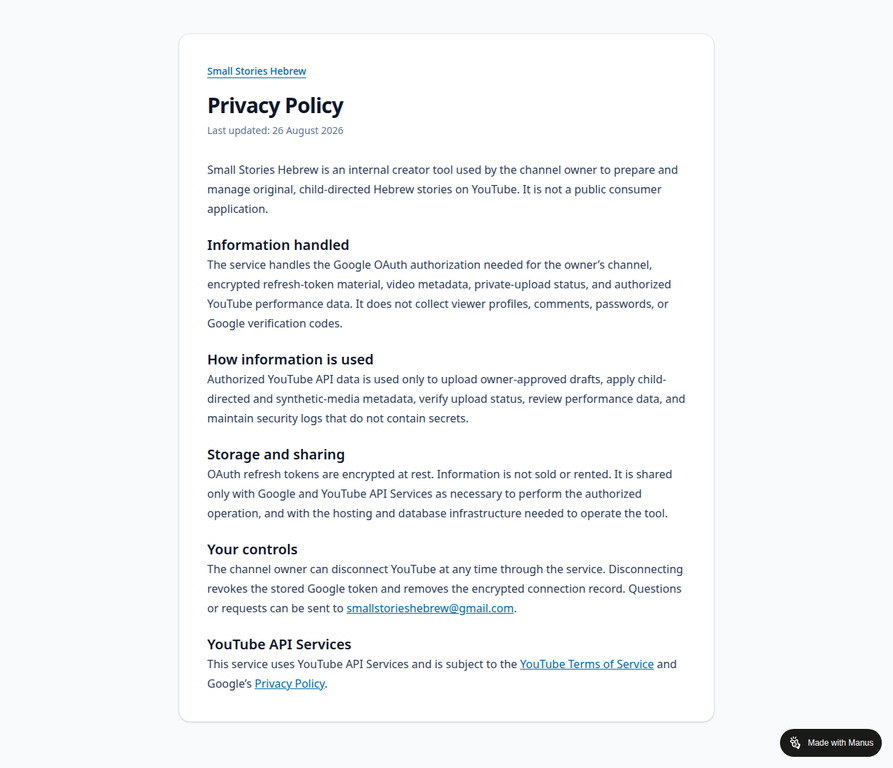

# Public Service and Privacy Policy Evidence

**Public service URL:** https://instafunnel-lphz3bum.manus.space/  
**Privacy Policy URL:** https://instafunnel-lphz3bum.manus.space/privacy

The service publishes a public Privacy Policy for Small Stories Hebrew. The policy states that the product is an internal creator tool for the channel owner, rather than a public consumer application.

The policy documents the following user-visible commitments:

1. Google OAuth is used only for the owner’s authorized channel.
2. Refresh-token material is encrypted at rest.
3. Authorized YouTube API data is used only for owner-approved drafts, child-directed and synthetic-media metadata, upload-status verification, authorized performance data, and security logs without secrets.
4. Viewer profiles, comments, passwords, and Google verification codes are not collected.
5. The owner can disconnect YouTube and revoke the stored authorization.

The screenshot above was captured from the public Privacy Policy page on 26 August 2026.
