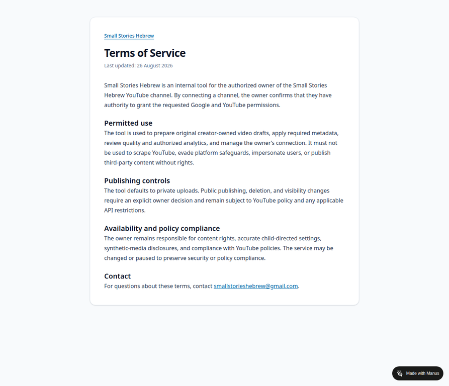

# Terms of Service Evidence

**Terms of Service URL:** https://instafunnel-lphz3bum.manus.space/terms

Small Stories Hebrew publishes public Terms of Service governing the internal creator tool. The terms state that the authorized owner must have authority to grant the requested Google and YouTube permissions.

The terms document these policy-aligned controls:

1. The tool prepares original creator-owned video drafts, applies required metadata, reviews quality and authorized analytics, and manages the owner’s connection.
2. The tool must not be used to scrape YouTube, evade platform safeguards, impersonate users, or publish third-party content without rights.
3. Uploads default to Private; public publishing, deletion, and visibility changes require an explicit owner decision and remain subject to YouTube policy and API restrictions.
4. The owner remains responsible for content rights, accurate child-directed settings, and synthetic-media disclosures.

The screenshot above was captured from the public Terms of Service page on 26 August 2026.
