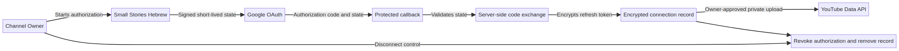

# OAuth Flow Evidence

**Authorized redirect URI:**  
https://instafunnel-lphz3bum.manus.space/api/youtube/oauth/callback

The authorization flow is implemented for the owner’s own YouTube channel only. The service does not request passwords, two-factor codes, or manual access to the owner’s Google credentials.

## Flow controls

1. The owner starts authorization from the service and signs in to Google directly.
2. The service creates a short-lived signed state value to protect the OAuth request.
3. Google redirects to the registered callback URI with an authorization code and state.
4. The server validates the state before exchanging the authorization code server-side.
5. Refresh-token material is encrypted before storage and is not returned to the UI or written to logs.
6. Private uploads use the owner’s authorized connection; the owner can later disconnect and revoke the stored authorization.

The flow is designed for official OAuth authorization, encrypted server-side token handling, owner control, and private-by-default uploads.
